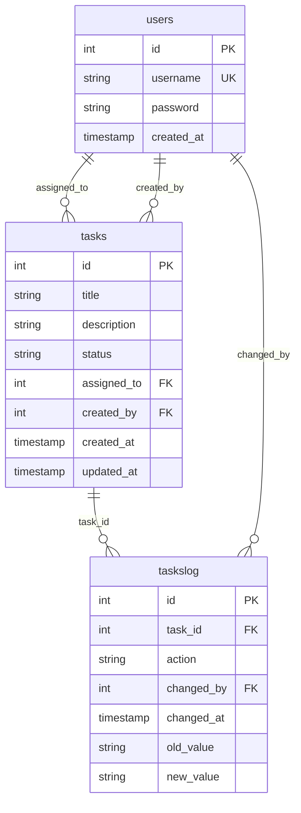

# Task management application with Flask
_Exported on 3/9/2026 at 19:17:33 EDT from Cursor (2.6.14)_

---

**User**

Context: I am working in a Software Startup firm as a Technical Project Manager
Objective: Create a proof-of-concept task management application using Flask(latest version) with a SQLite database, relying on raw SQL for all database interactions.

Application should have following functionalities:
1. Offer simple user authentication (no advanced security measures)
2. Enable each users to create tasks, assign tasks to others, and set/update task's status
3. Present a main view that lists all tasks, shows each task status and indicates the user to whom its assigend to
4. Include minimal frontend templates rendered through Flask(no JavaScript Frameworks)
5. User account creation (register a new user)
6.Login/Logout flow (session-based)
7. Task management
8. Create a new task and assigning it to a user
9. Possible status for tasks are: draft, refined, active, in-progress, completed, rejected
10. Edit or delete task as needed

Main view should have below:
1. Display a list of all tasks along with their statuses and assigned users
2. Include basic filtering by status or by user if feasible

Requirements:
1. Use Python 3.13 or latest version
2. Run within a virtual environment (self-hosted)
3. No advacned production-level security features are needed
4. Implement user and task data storage with SQLite and sqlite3 python module (no SQL Alchemy)
5. A DB model with minimal set of tables is needed like (users, tasks, taskslog)
6. Implement a simple user authentication as follows:
     a. Implement a minimal usernam/password login system
     b. No multi factor authentication or complex role based access is required
     c. Store Passwords in plain-text 

Assume a self-hosted environment.
Provide (or describe) any basic setup and run instrcutions (eg:how to install dependencies and start the flask server)


---

**Cursor**


Exploring the workspace, then creating the Flask-based task management proof-of-concept.


Creating the Flask task management application and adding project files.


Adding DB initialization and creating `requirements.txt` and README.


Verifying the application runs:


Summary of what’s been set up:

## Task Manager POC - Summary

### Project structure

```
porjecttaskman/
├── app.py              # Flask app with routes
├── database.py         # Raw SQL + schema (users, tasks, taskslog)
├── requirements.txt    # Flask dependency
├── README.md           # Setup and run instructions
├── .gitignore
├── templates/
│   ├── base.html       # Layout and shared styles
│   ├── login.html      # Login form
│   ├── register.html   # User registration
│   ├── index.html      # Task list with filters
│   └── task_form.html  # Create/Edit task form
└── venv/               # Virtual environment (created)
```

### Features

| Feature | Status |
|--------|--------|
| User registration | Yes |
| Login / logout (session-based) | Yes |
| Create tasks, assign to users | Yes |
| Edit / delete tasks | Yes |
| Task statuses: draft, refined, active, in-progress, completed, rejected | Yes |
| Main view: list tasks, status, assignee | Yes |
| Filter by status or assignee | Yes |
| Plain-text passwords | Yes |
| Raw SQL (no ORM) | Yes |

### How to run

```bash
cd porjecttaskman
source venv/bin/activate   # (Windows: venv\Scripts\activate)
pip install -r requirements.txt   # Already done
flask run   # or: python app.py
```

Open **http://127.0.0.1:5000** and register to create your first user and tasks.

### Database tables

- **users**: id, username, password, created_at  
- **tasks**: id, title, description, status, assigned_to, created_by, timestamps  
- **taskslog**: id, task_id, action, changed_by, changed_at, old_value, new_value  

The SQLite file `taskman.db` is created automatically on first run.

---

**User**

Generate a mermaid diagram script for the tables defined in @database.py 
Ensure this mermaid script can be used to generate DB model diagram.


---

**Cursor**


Generating a Mermaid ER diagram from the `database.py` schema:


Simplifying the diagram for broader Mermaid compatibility:


Created `db-model.mmd` with a Mermaid ER diagram for your schema. Contents:



**How to view the diagram**

1. **GitHub/GitLab** – Put the script in a `.md` file and they will render it.
2. **Mermaid Live Editor** – https://mermaid.live – paste the script and export as PNG/SVG.
3. **VS Code / Cursor** – Use the “Mermaid” extension and preview the file.
4. **Notion, Confluence, etc.** – Use their Mermaid / code-block support to render it.

**Legend**

- `PK` – primary key  
- `UK` – unique constraint  
- `FK` – foreign key  
- `||--o{` – one-to-many (one user → many tasks/logs)

---

**User**

@README.md  Check formatting and apply corrections as needed

---

**Cursor**


Fixing README formatting: correcting the ER diagram section structure, list formatting, and section spacing.


Escaping `|` in the table so it doesn't break the Markdown:


Summary of formatting changes applied:

**Edits:**

1. **ER diagram section**
   - Replaced plain text with proper Markdown headings and lists.
   - Renamed heading to “ER DB Model Diagram” (consistent with other headings).
   - Added a reference to the `db-model.mmd` file.

2. **“How to view the diagram”**
   - Turned into a proper subheading (`###`).
   - Converted items into bullet points with bold labels.
   - Fixed the Mermaid Live Editor link to `[mermaid.live](https://mermaid.live)`.

3. **Legend**
   - Converted to a Markdown table.
   - Escaped pipe characters in the “one-to-many” row with HTML entities so the table parses correctly.

4. **Section structure**
   - Removed the extra blank line after “Security Note” for consistent spacing.
   - Normalized list formatting across sections.

